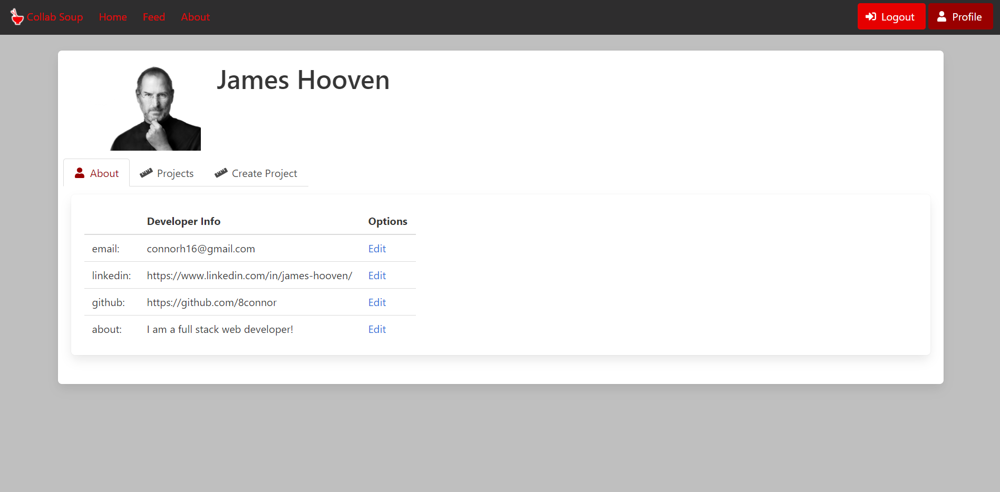

# Collab_Soup

## About

Collab soup is a website dedicated to serving the developer community. We have personally found ourselves in the past looking for help on projects that were out of our grasp to handle alone. This website was created to make collaborating with other developers easier.

## Features:

- User account creation
- Persistent user sessions
- User authentication
- User profiles
- Project collaboration

## Technologies used

- Node.js
- jQuery
- Express
- Handlebars
- Bulma
- SQL
- Sequelize
- Sass
- HTML
- CSS

# Screenshots:

